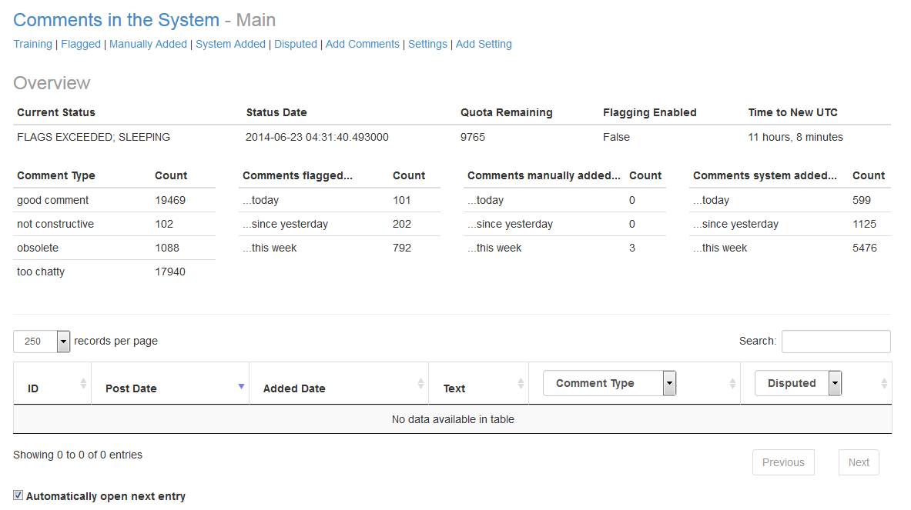
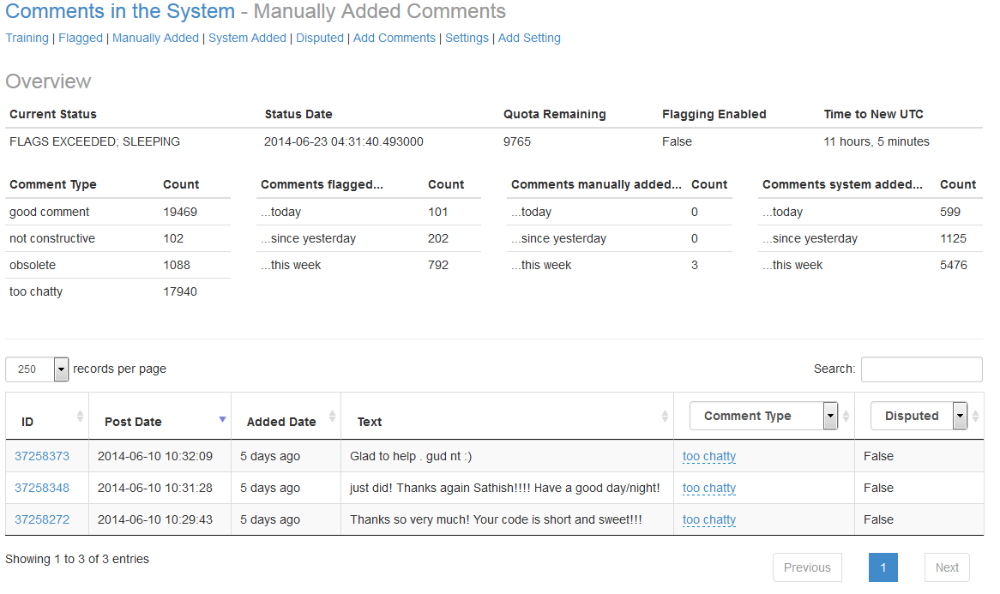

## Automated Stack Overflow Comment Flagging application

Stack Overflow's [model](http://stackoverflow.com/help/flagging) of limiting comments that don't contribute to the problem 
or solution at hand is admirable. Users are able to [comment everywhere](http://stackoverflow.com/help/privileges/comment) 
once they have reached 50 reputation points. Prior to this, users can comment only on their own posts. Despite the requirement 
for a small amount of reputation, there is still countless pointless comments added hourly.

This project is designed help clean up comments, in a small way. Unfortunately, I am limited to only 100 comment flags daily,
thus will only be able to help clean those flags. Additionally, the task of flagging the same comment types becomes
monotonous. Fortunately, this means I should be able to automate it.

I have three major goals in the development of this project:

 - Machine learning; I should be able to use a simple Naive Bayes (and potentially other) algorithms to teach a system
 my flagging history. For historical purposes, prior to bringing this system online, I have approximately 9,500 comment
 flags and only 34 of those have been declined. My goal is to maintain this high rate of accuracy, while still flagging
 the maximum number of comments I am able to a day.
 - Flask; I will develop a basic web control panel that allows me to quickly see an overview of the system, adjust settings,
 and adjust flag types the system has made. These adjustments will be used when the system is retrained, based on recent
 flags.
 - Stack Exchange API; None of the automated flagging would be possible without utilizing the [Stack Exchange API](http://api.stackexchange.com/).
 I will be using a very heavily modified version of [pyso.py](http://stackapps.com/questions/1722/pyso-py-python-stack-overflow-library) and 
 [se-api-py](http://stackapps.com/questions/3881/se-api-py-a-lightwight-python-wrapper-for-se-api) for this API work. 
 
### Initial Set up
 
 - Download the repository
 - Run `pip install -r requirements.txt`
 - Run `python -m textblob.download_corpora`
 - Run `python populate_database.py` for inital table creation (it will be in an SQLite Database)
 - Launch the web control panel and navigate to the Settings; Fill in the appropriate values for your API information
 - You are now ready to continue

### How to run the web control panel:

 - The Flask Control panel can be run from Windows by executing the `run_flask.bat` file. If it is run within Linux, then the 
 `PYTHONPATH` needs to be modified to include the root of this project and then you can execute `python FlaskPanel\app.py`. 
 This modification is needed so that modules at a sibling level to `FlaskPanel` can be included.
 
After the above command is executed, you can visit `localhost` and see the panel's main dashboard

This gives a very nice overview of the system's current status. From here main of the break downs are selectable and will
show the comments associated with that data point. For example, by clicking on the "Comments manually added..." -> "...this week"
data point, you can see the three comments manually added to the system this week. 

### Settings:

The System has several dynamic settings, available in the "Settings" subheader link.

 - `classifier_algorithm` - Setting value that corresponds to which `TrainingAlgorithm` to utilize. This `TrainingAlgorithm` will
 have a Training File Location that is set to the full path of `CLASSIFIER_NAME` defined in `NaiveBayesV2`
 - `current_status` - The current status of the flagging application. This should *NOT* be adjusted manually.
 - `current_status_datetime` - The timestamp of when `current_status` changed. This should *NOT* be adjusted manually. Should be in UTC.
 - `current_status_last_run_datetime` - The last time the flagging application ran. This should *NOT* be adjusted manually. Should be in UTC.
 - `flagging_enabled` - True/False value that will determine whether to flag comments on StackOverflow
 - `flagging_max_comments_retreive` - Maximium number of comments to retrieve per run. Default is 1000 and this equates to 10 pages at 100 comments per page (10 API calls).
 - `max_history_days` - Number of previous days to include when pulling data from database.
 - `min_sleep_between_comment_fetch` - Time between comment retrievals. The system may scale this time, but it will never drop below this limit.
 - `min_sleep_between_flags` - Time between issuing a flag. The system may scale this time, but it will never drop below this limit.
 - `se_api_comment_filter` - Filter to use when getting comments.
 - `se_api_key` - StackOverflow API key that is associated with all requests sent.
 - `se_api_remaining_quota` - Number of calls to the API remaining. If this reaches zero, the system will stop retrieving comments until the next UTC day. This should *NOT* be adjusted manually.
 - `se_api_token` - StackOverflow access token used when making API calls.
 
 
### My Process

This project began with the need for data from the [Stack Exchange Data Explorer](http://data.stackexchange.com/). "Good" and "Bad"
comments were needed for training. This was accomplished by running the provided queries in the `data_sql` directory of 
this repository. 

These two queries gave a very high level classification of the comment types and provided approximately 32,000 comments to work
with. The next step was to validate the classifications and reclassify if appropriate. This process took several weeks to ensure
that the classifications were accurate. At the end of this step, comments had been classified into "Good Comment", 
"Too Chatty", "Obsolete" and "Not Constructive" comment types. This was done and as I would have flagged them, had I encountered
them on Stack Overflow. 

The next step was to train and build the first classifier. The first Naive Bayes classifier built turned out very poorly. The results
of this version are available in the `NaiveBayesV1` directory. Basically, the algorithm provided, classified all comments (with
very few exceptions) as being a member of all comment types.

The second Naive Bayes attempt, available in the `NaiveBayesV2` directory turned out to work very well. The results of this attempt
are available in it's directory. It's initial tests proved to be in the 80-90% accuracy range with test data. 

Combining `NaiveBayesV2` with a threshold for how much certainty I required before flagging, the system was built to flag
certain comment types. By requiring 99% certainty for "Obsolete" and "Too Chatty" flags, the system has maintained a high
flagging accuracy. Additionally, comments that are "Good Comments" are only added to our training set if the system is 99.95% 
certain it is a good comment.

When a comment is above the threshold, and it is configured in the system to issue a flag, API calls are made to get the comment's
option ID for the flag type we want to issue. Then the comment is flagged with this option id. This results in a flag being added
to the system under the user associated with the `se_api_token` in the system.

### How to train the system

Training takes place infrequently, due to the time it takes. The initial training set was done with a `threshold` of 700. 
This means that the system will pull 700 comments per comment type and train against those. If a comment type does not have
700 associated comments, it will not be an option to train against. The initial set had three training options: "Too Chatty",
"Obsolete" and "Good Comment". 

To (re)train, the `THRESHOLD` variable in `algorithms/NaiveBayesV2/NaiveBayesV2.py` needs to be adjusted as appropriate. The 
`CLASSIFIER_NAME` should be adjusted to not over write an existing classifier blob. Finally, `TRAIN` should be set to `True`.
If you wish to adjust the amount of data that the system uses to test against, adjust the `TRAINING_RATIO`. This ratio 
is used to peel off data, after it is initially retrieved from the database, and use it to validate your training set. A 
ratio of 0.75, and a threshold of 700, and three comment types with that threshold, will result in 1,575 comments being used to 
train the system and the remaining 525 being used to test the accuracy of the classifier.

Once you have adjusted the settings in the previous paragraph, run the `algorithms/NaiveBayesV2/NaiveBayesV2.py` script.
Be aware that the higher the threshold, the longer training will take. 

 

 
### Results:

Thus far, the system has maintained a high accuracy rate. The first week or two had a higher rate of error, but by adjusting the thresholds 
for when each flag type was to be issued, the accuracy has improved. The initial training data set was trained with a threshold of 700. As time goes on,
the plan is to retrain the system using the data that it has flagged to build an even more accurate classifier. Using this strategy, though,
I need to be aware of possible over fitting. 

As it stands, with a required 99% certainty to issue an "Obsolete" and a 99.9% for "Too Chatty" flag, the system can flag 100 comments in a matter of 
hours. A majority of those can be done in the first loop of the day, due to it picking up flags since the last run.

